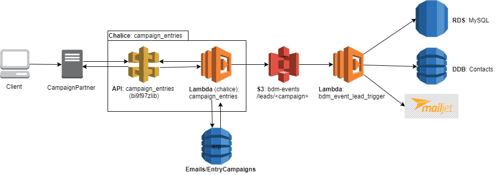

# Chalice_CampaignEntries

[Chalice app](http://github.com/aws/chalice) to unify adding of
emailadressess/contacts via campaigns. Campaigns can be both internal or
external.

It checks for data-validity, email existence in the db and responds.
It saves the provided data as JSON to S3.

The flow is documented below:



A "CampaignPartner" is any external entity that will be allowed to deliver
(subscribe) contacts to the Biedmee-database. This can be an external company
but also any other entrypoint through which contacts can enter the system
(so called "splash-pages", subsription-forms)

The Chalice app defines a JSON-API with API keys for every CampaignPartner.
The Chalice app peforms some checks and responds to the CampaignPartner with:

```json
"lead": {
    "status": "success|fail",
    "data": {
        "reason": "Succes|Duplicate contact|Invalid email|...",
        "email": "alice@example.com",
        "lead": "accepted|rejected"
    }
}
```

It then stores the contact with all details and metadata as a JSON-object on S3,
which further triggers a λ-function that further processes the contact and
stores it where it should be stored.
